

# User Interface

## Home Screen

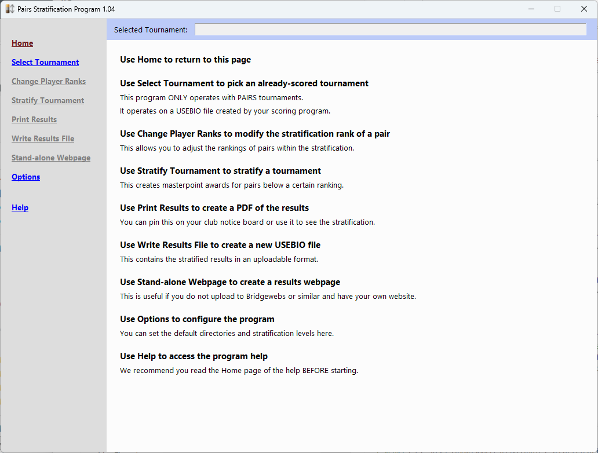{ align=right width="400" }

When you run the program, you will see the user interface (click on any image to see it full size)

At the left is a menu, allowing you to navigate the various functions offered by the program. 
Only functions that are active can be clicked. Those that are disabled are grey. As you progress through loading and stratifying a tournament, these functions will be enabled.

The top of the window displays the selected tournament (once you have selected one). This is displayed at the top for all functions that you select, so you can easily verify you're working with the right one.

Brief help on these functions is displayed in the information pane to the right.
When you select a function from the menu, the information pane will change to show information and offer input fields relevant to the function.

## Select Tournament

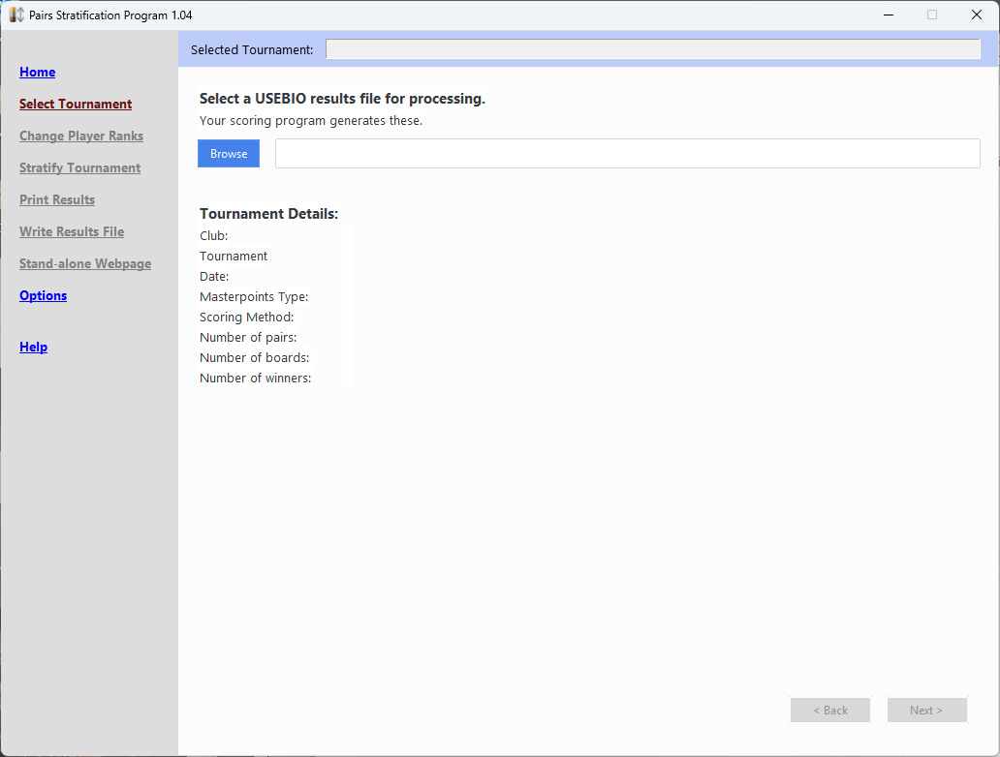{ align=right width="400" }

The Select Tournament function is the one you want to start with.

This is where you select the USEBIO file (output from your scoring program) that you wish to use.

You can use the Browse button to interactively choose the file, or just type the file name into the field next to the button.

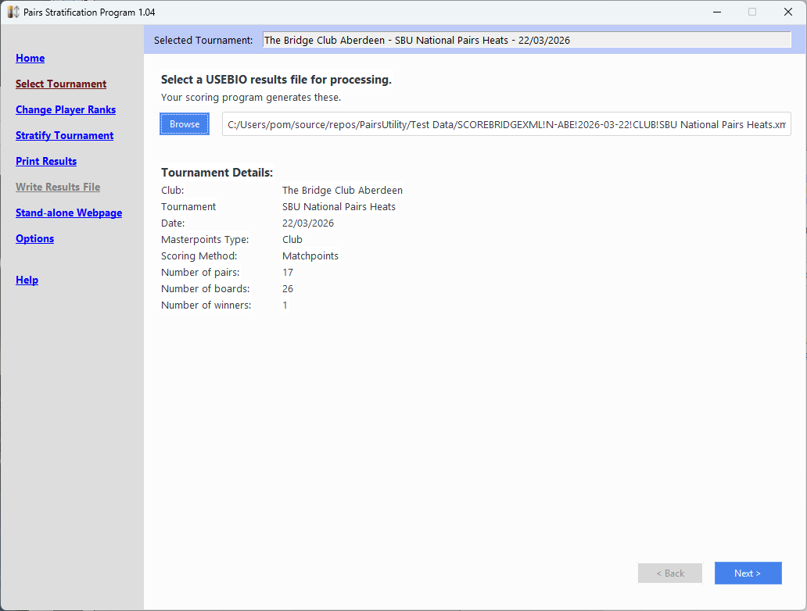{ align=right width="400" }

Once a file has been chosen, the tournament name will be displayed at the top and the tournament details in the information pane. This allows you to verify that you have chosen the correct file. All functions in the menu will then be enabled, except for Write Results File.

Note that the tournament name is displayed at the top of the information pane and will remain there as you navigate to other functions.

Once a file has been selected, the Next button at the lower right is enabled.

**The Next and Back buttons provide you with a way to navigate through the stages of stratification instead of cicking the menu, although you
can do that if you choose**.

### Change Player Ranks

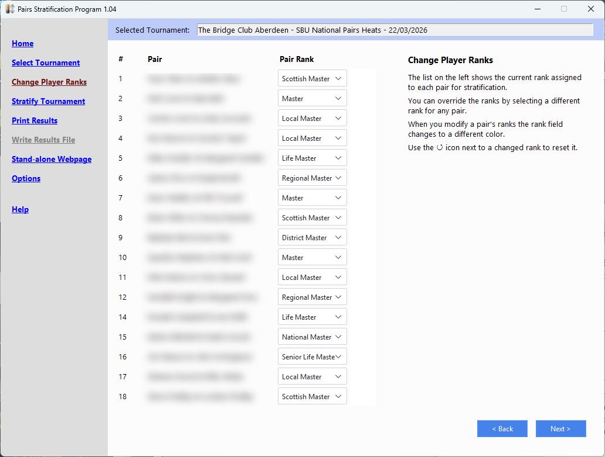{ align=right width="400" }

Use the Change Player Ranks function to modify the assigned ranks to each pair.

Each pair has the rank that will be used for stratification assigned to them automatically. Partners of differing ranks will be assigned
the highest rank in the partnership.

Each pair is listed with both their pair number and names, next to the rank they have been assigned. Click on the rank next to the pair
to open up a list of the ranks and choose a different one.

### Changed Ranks

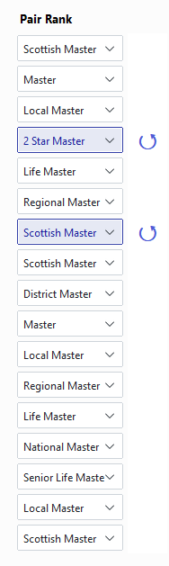{ align=right width="94" }

When you change a pair's ranking, the ranking is displayed in a different colour and an icon appears to the right of the rank to allow
you to reset it to the automatically determined value, should you change your mind.

The rankings you set up here are those used for stratification.

## Stratify Tournament

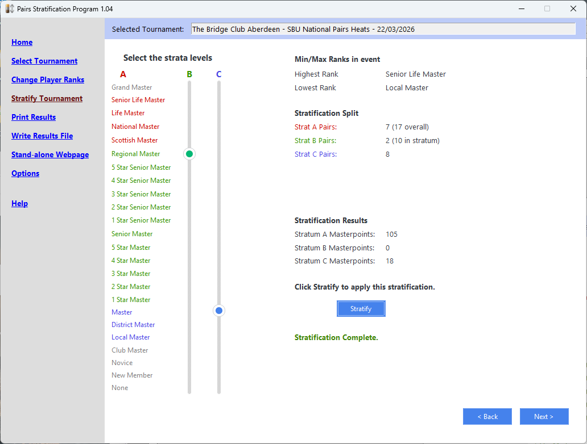{ align=right width="400" }

Use the Stratify Tournament function to stratify a tournament.

The component parts of this function are described in the following sections.

### Strata Levels Sliders

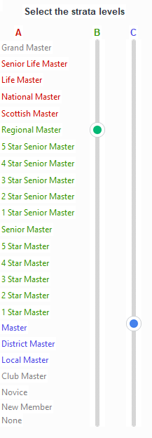{ align=right width="150" }

This presents you with two "sliders", allowing you to select the levels at which stratification will be done.

At the left are the masterpoint rank text labels. These are color coded as follows:

* Grey - Masterpoint ranks below the lowest pair rank and above the highest pair rank that played in the tournament are grey. You cannot move the sliders to these ranks.
* Red - These ranks are only included in the overall results (stratum A) and represent all ranks above those placed in stratum B or C. If you set the stratification levels to the minimum, all the labels would be black and there would be no stratification to be done.
* Green - Stratum B.
* Blue - Stratum C

As you move the strtaum B and C sliders, the labels change colour to indicate which rankes are in which stratum.

To configure up just stratum B, leave the stratum C slider at its lowest point.

### Min/Max Ranks in event

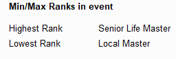{ align=right width="256" }

This section displays the ranks of the highest and lowest ranked pair competing in the selected event.

### Stratification Split

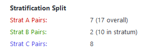{ align=right width="292" }

This shows the number of pairs in each stratum. As you move the sliders, the numbers here will change. Two-winner events have entries for both N/S and E/W.

The number in brackets after stratum A and B show the number of players in each stratum **plus** the number of players in lower strata.

Here, for example, there are a total of 17 pairs in the tournament. 7 pairs are above the stratum B level and so will appear in the overall results only (Stratum A). 2 pairs are Stratum B ranks and 8 are Stratum C ranks.

The lower strata are always included in higher strata, so the pairs in Stratum C are included in Stratum B (hence there are 10 pairs in the stratum). So, in this case, Stratum B consists of 2 Stratum B ranks and 8 Stratum C ranks.

### Stratification Results

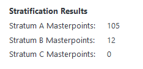{ align=right width="234" }

After stratification, this shows the number of masterpoints awarded in to pairs of each stratum rank. So, in this case, 105 masterpoints were awarded to pairs that are stratum A pairs (i.e., do not appear in the lower strata), 12 masterpoints were awarded to stratum B pairs and no masterpoints awarded to stratum C pairs.

Warning messages will be displayed below the results, in orange, as you move the sliders and the selected ranks are unsuitable for stratifying. For example, if there are too few pairs in the lowest stratum to award masterpoints, a message to this effect will appear.

When stratification is successful, a message will be displayed in green (like the example), to let you know.

### Stratify button

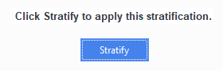{ align=right width="288" }

When the selection of stratification ranks are suitable for stratification, this button be enabled and allow you to stratify the event.

Click the Stratify button to run the stratification process. You will be shown a message in the Stratification Results section in green when the process is complete (it's very quick).

Once stratification is complete, the Write Results File menu function will be enabled.

## Print Results

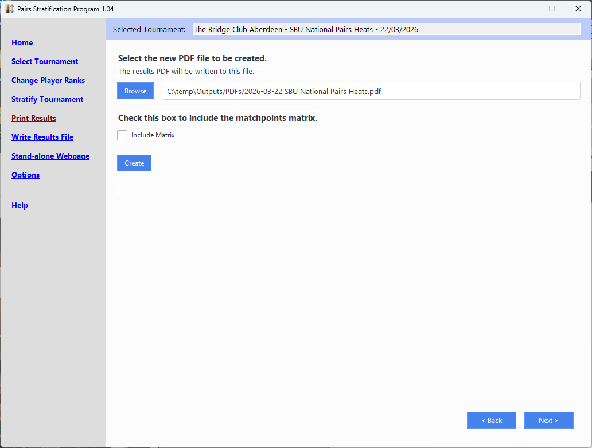{ align=right width="400" }

This function will create a PDF file of your results, suitable for printing and pinning to your notice board. The PDF file will also be automatically displayed in your default PDF viewing program (e.g., your browser), from which you can print it.

You can use the Browse button to select a different location and name for the PDF file.

You can, optionally, include the match points matrix by checking the "Include Matrix" check-box.

This function is only enabled after selecting a tournament. If you don't stratify the tournament it will print unstratified results.

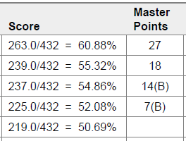{ align=right width="264" }

If you have stratified the tournament, then both the overall results and the results for each stratum will be produced.

If the masterpoints awarded to a pair is not the current stratum, the stratum from which the masterpoints were awarded is displayed in brackets after the award. In the example (overall results), the top two pairs were awarded masterpoints in Stratum A and the third and fourth places were awarded masterpoints in Stratum B.

## Write Results File

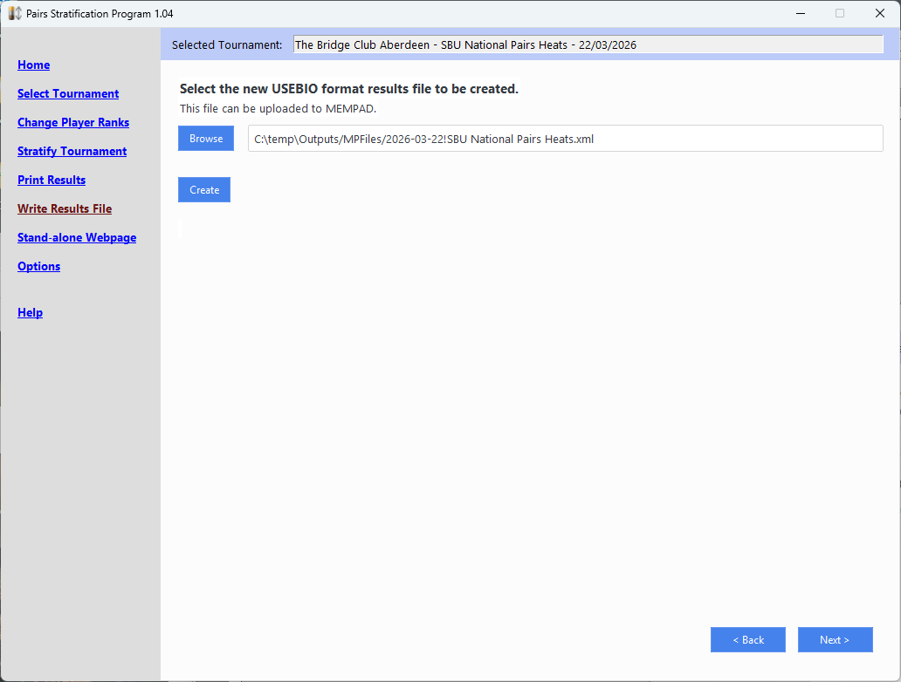{ align=right width="400" }

This function allows you to produce a new USEIO file, suitable for uploading to MEMPAD or Bridgewebs, that contains the revised set of masterpoints awarded and includes the XML elements detailing the stratification performed.

You can use the Browse button to select a different location and name for the USEBIO file.

Use the Create button to generate the file. A message is displayed once the process is complete.

**Note that this does NOT upload the file - it just generates it and allows you to choose where the new USEBIO file is located, and its name**.

## Stand-alone Webpage

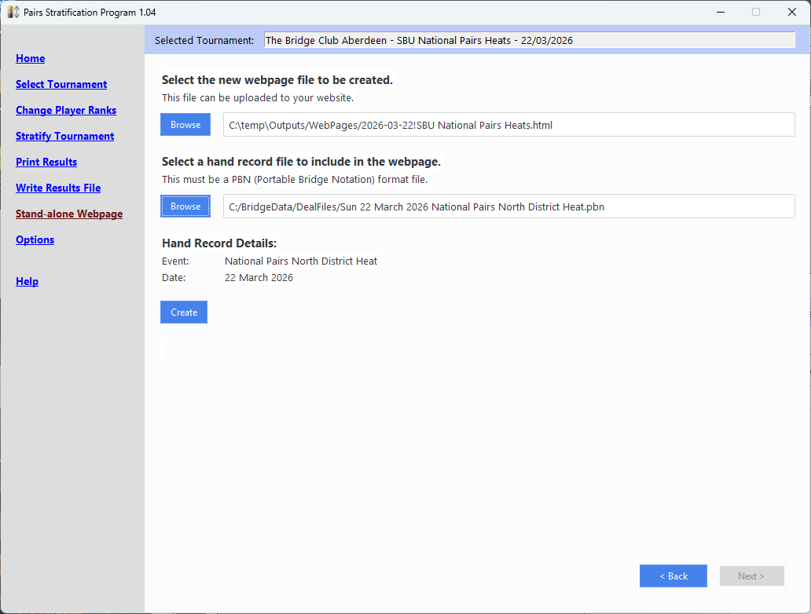{ align=right width="400" }

This is intended for clubs that do not use an online service to display the results, but rather host their own website.

It produces a single HTML file that can be uploaded to your website. The HTML file is based on a "template" file that you can tailor to your needs. Two slightly different template files are provided as a starting point.

You can use the Browse button to select a different location and name for the HTML file.

If you want to have the hand records included in the web page, use the second Browse button to locate the hand record file (i.e. .PBN file) for the tournament. Once a hand record file has been selected, the event name and date are displayed so that you can confirm you have the correct hand record for the event. The program will also perform its own check that the date matches, but it's up to you to check the event name is correct (you may have been running more than one event on the same day).

N.B. This is *not* the .PDF hand record file that some clubs may also upload to their website.

Click Create to produce the HTML file and then upload this to your website.

### HTML Templates

Two sample template files are included with the program. These are located in the directory you installed the program into.

The program uses these as a starting point and writes the results into the files (as JSON strings, for the technically minded). Program code, written in JavaScript then processes these results when the web page is displayed, producing the results and personal scorecards.

#### SingleFileTmpl.html

This template contains the styling (CSS) used in displaying the web page and the JavaScript that generates the results and personal scorecards.

If you use this template, you can directly display the produced HTML file in your browser simply by double-clicking on the HTML file, since everything that is needed is contained in the one file.

The disadvantage of this template is that once you have many web pages, the styling and JavaScript are replicated in every file and, so, consume unnecessary disk space. Also, should you wish to change the styling of the page, you would modify the template and all new HTML files created using the modified template would have the new styling, but existing pages would not.

#### TinyFileTmpl.html

This template contains the HTML to display the page but, rather than having the styling and program code embedded in it, contains links to separate files on you web server that hold the CSS and JavaScript.

This makes the HTML files smaller and has the advantage that changes to the styling or program code affect all existing HTML files generated from this template. You must host the CSS and JS files separately on your website in a location that can be accessed by the HTML file when it is displayed.

You will doubtless need to copy the template and modify it so that you can modify the links to the CSS and JS files.

Webpage.CSS and WebPage.JS contain the styling and program code for you to upload to your server (modifying the CSS file for the styling you require).

#### Modifying the HTML Templates

You can modify the HTML templates to create content that is better suited to your website. Should you choose to do this, please make a copy of one of the existing templates and modify the copy. Should you upgrade the program, the supplied templates may be overwritten - so work on a copy. The same applies to the JavaScript and CSS files, should you use them.

The supplied JavaScript (embedded in SingleFileTmpl.html and separately in webpage.js) obtains the result data that it uses for the webpage from a <head> element:
	
The results are inserted (in JSON form) by the program. Therefore your web page template MUST include this script element.

## Options

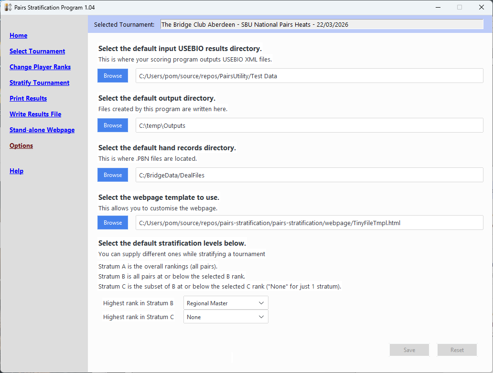{ align=right width="400" }

The Options function allows you set up some default information specific to your scoring environment to make it easier to use the program.

Selecting the default USEBIO input results directory allows the Select Tournament function to look in that directory when you click Browse to select a tournament.

Selecting the default output directory allows you to specify a directory that the outputs of the program will be written to. These can be overridden when using the Browse button to select and output file but, by default, 3 directories are created underneath this output directory named MPFiles (USEBIO output files), PDFs (print files) and WebPages (guess!). A cache directory is also created here to hold the cached copy of the player's database obtained from MEMPAD.

Selecting the default hand records directory allows you to specify where your hand records (.PBN files) are normally held.

The above options are "convenience" options intended to reduce the amount of browsing on your file system by starting at the same directory each time.

The Options function is also where you select the web page template to use (see Stand-alone Webpage).

Finally, you can select the default stratification levels that the program will use. Once again, this is a convenience to help reduce the number of things you need to change when performing stratification. You can change the stratificiation levels from the defaults when stratifying a tournament (see Stratify Tournament), but the levels shown there will revert to the defaults specified in this Options function when the program is restarted.

After making any change to the options, click the Save button to save them. You can click the Reset button to return any changed fields to their current values.

